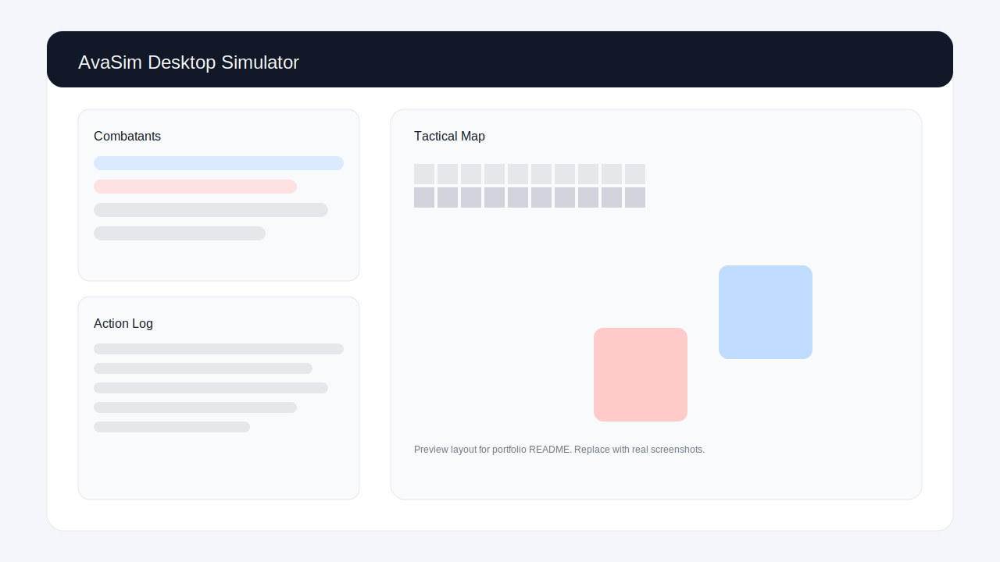
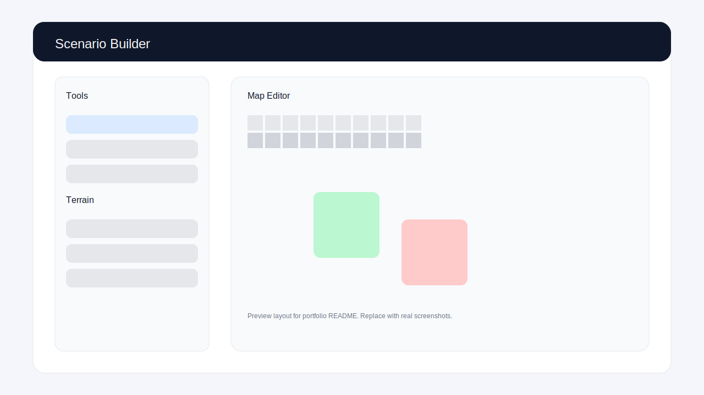
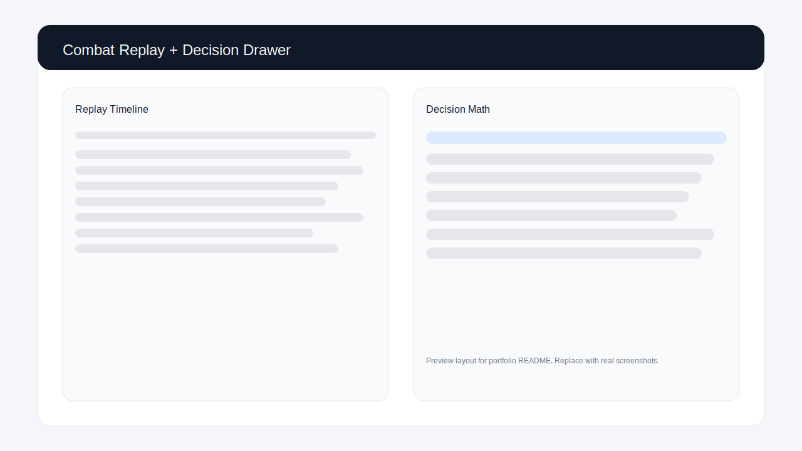

<p align="center">
  
</p>

# AvaSim - Avalore Combat Simulator

A desktop combat sandbox for the Avalore tabletop RPG. Build combatants, run AI or manual turns, and inspect detailed decision math on a tactical grid.

**Jump to:** [Screenshots](#screenshots) · [Key Features](#key-features) · [Quick Start](#quick-start) · [Architecture](#architecture) · [Project Status](#project-status)

**Screenshots**







Note: These images are placeholders for the portfolio landing page. Replace them with real screenshots from the app UI when available.

**Key Features**

- Full Avalore action economy, weapon, armor, shield, and feat resolution
- Tactical grid map with terrain, movement penalties, and range overlays
- Scenario builder for placing terrain and units with save/load
- Decision math drawer with EV logging and action traceability
- Replay timeline with per-action snapshots
- Export combat logs to HTML and CSV

**Quick Start**

```bash
pip install -r requirements.txt
python3 pyside_app.py
```

**Tests**

```bash
python3 -m unittest -v
```

**Architecture**

- `combat/engine.py`: core combat engine and turn resolution
- `combat/participant.py`: character state and action economy tracking
- `combat/items.py`: weapons, armor, shields, traits
- `combat/feats.py`: feat definitions and behavior
- `combat/spells.py`: spell definitions and casting mechanics
- `ui/`: Qt widgets and tactical map rendering
- `pyside_app.py`: desktop application entry point and UI wiring

**Project Status**

- Spellcasting is implemented in the engine, but the UI currently keeps spellcasting disabled.
- The focus is on rules fidelity, combat visualization, and AI transparency.

**Packaging**

A PyInstaller spec is available at `packaging/avasim.spec` with version metadata in `packaging/version.txt`.

**Docs**

Rules references and design notes live in `docs/`.
