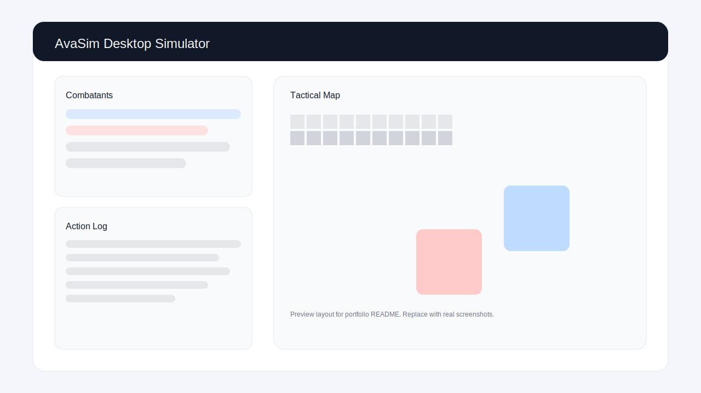
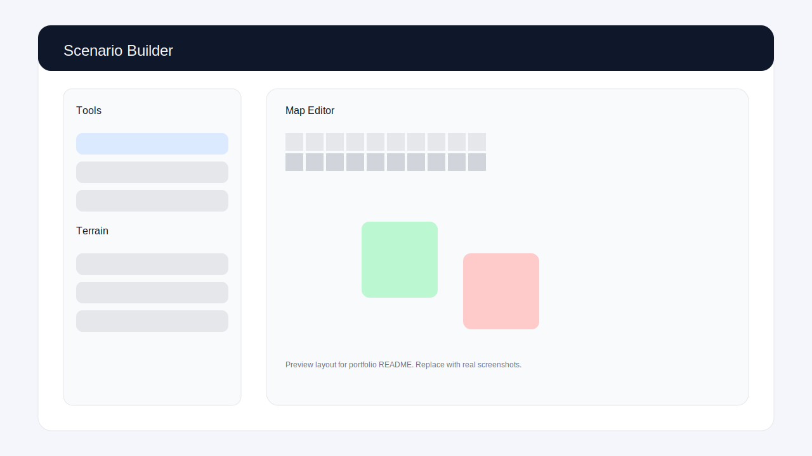
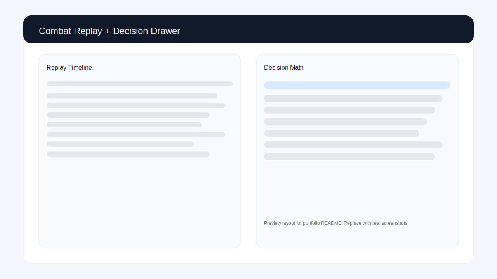

<p align="center">
  
</p>

# AvaSim - Avalore Combat Simulator

A desktop combat sandbox for the Avalore tabletop RPG. Build combatants, run AI or manual turns, and inspect detailed decision math on a tactical grid.

**Jump to:** [Screenshots](#screenshots) · [Key Features](#key-features) · [Quick Start](#quick-start) · [Architecture](#architecture) · [Project Status](#project-status)

**Screenshots**







Note: These images are placeholders for the portfolio landing page. Replace them with real screenshots from the app UI when available.

**Key Features**

- Full Avalore action economy with a unified "one Limited action per turn" budget shared by feats and maneuvers
- All **100 feats** from [avalore.net/feats](https://avalore.net/feats) cataloged (59 engine-wired); weapon, armor, and shield resolution
- Maneuvers (Grapple, Disarm, Struggle, Shove, Topple, Pull) and the Prone/Grappled conditions
- Critical → Death Save → Bleedout chain with stabilization, plus stealth Sneak Attacks
- Tactical grid map with terrain, movement penalties, and range overlays
- Scenario builder for placing terrain and units with save/load
- Decision math drawer with EV logging and action traceability
- Replay timeline with per-action snapshots
- Deterministic pure-Python analysis API for single runs, batches, and paired loadout comparisons
- Export combat logs to HTML and CSV

**Quick Start**

```bash
pip install -r requirements.txt
python3 pyside_app.py
```

**Tests**

```bash
python3 -m unittest -v
make benchmark-analysis
```

**Architecture**

- `combat/contracts.py`: versioned analysis request/result dataclasses
- `combat/runtime.py`: canonical `run`, `run_batch`, and `compare` APIs
- `combat/factory.py`: pure build/scenario conversion without Qt widgets
- `data/avalore/v1/`: versioned JSON catalogs for static rules data
- `combat/engine.py`: core combat engine and turn resolution
- `combat/participant.py`: character state and action economy tracking
- `combat/items.py`: weapons, armor, shields, traits
- `combat/feats.py`: all 100 feat definitions (source of truth; exported to `data/avalore/v1/feats.json`)
- `combat/feat_handlers.py`: typed feat-effect handlers dispatched by the engine
- `combat/spells.py`: spell definitions and casting mechanics
- `ui/`: Qt widgets and tactical map rendering
- `pyside_app.py`: desktop application entry point and UI wiring

**Project Status**

- The PySide desktop app and Python combat engine are canonical.
- The TypeScript orchestrator, Rust service, Docker stack, and schema package are frozen experimental reference work until the Python runtime contract is stable.
- Spellcasting is implemented in the engine, but the UI currently keeps spellcasting disabled.
- The focus is on reproducible analysis, rules fidelity, combat visualization, and AI transparency.

**Packaging**

A PyInstaller spec is available at `packaging/avasim.spec` with version metadata in `packaging/version.txt`.

**Docs**

Rules references and design notes live in `docs/`:

- [`docs/mechanics_reference.md`](docs/mechanics_reference.md) — canonical combat mechanics and an implementation-coverage matrix
- [`docs/feats_catalog.md`](docs/feats_catalog.md) — all 100 feats by category with effect text and engine-wired status
- [`docs/analysis_core.md`](docs/analysis_core.md) — the current canonical analysis direction

The feat catalog is the data in `combat/feats.py` (exported to `data/avalore/v1/feats.json`); refresh the
scraped source of truth with `python scripts/fetch_feats.py`.
