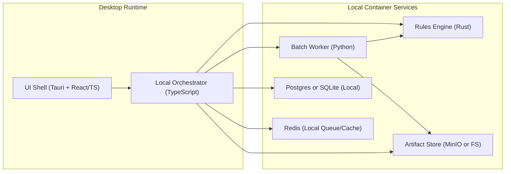
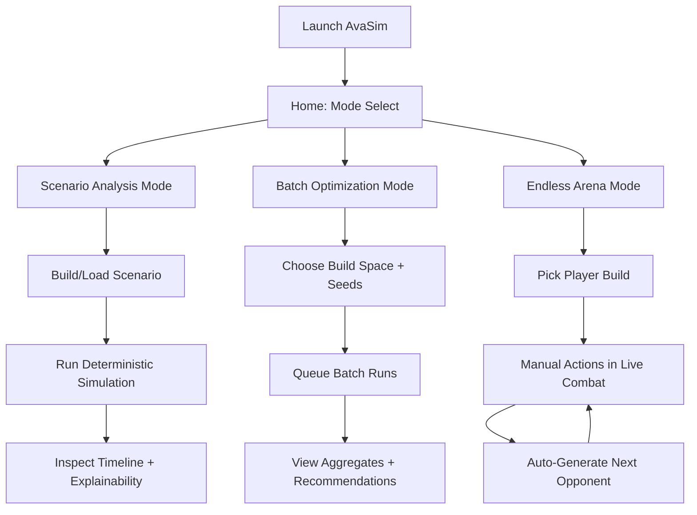
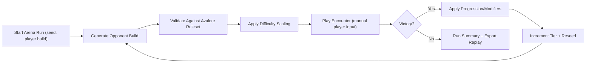
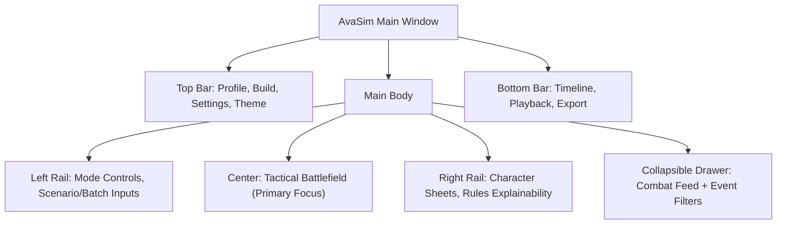
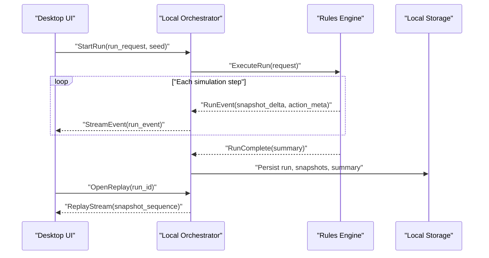

# AvaSim Visual Schema

This companion document provides visual schematics for the next-gen offline AvaSim design.

## 1. Offline System Topology

## 2. Mode Selection and User Flow

## 3. Endless Arena Encounter Generation

## 4. UI Surface Blueprint (Production Layout)

## 5. Deterministic Replay Data Flow

## 6. Design Intent Notes

- The simulation remains fully offline and deterministic.
- The same event schema feeds all three modes.
- Endless Arena is a first-class mode, not an add-on.
- UI hierarchy keeps battlefield and explainability visible at all times.
