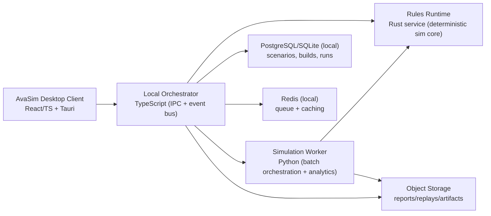
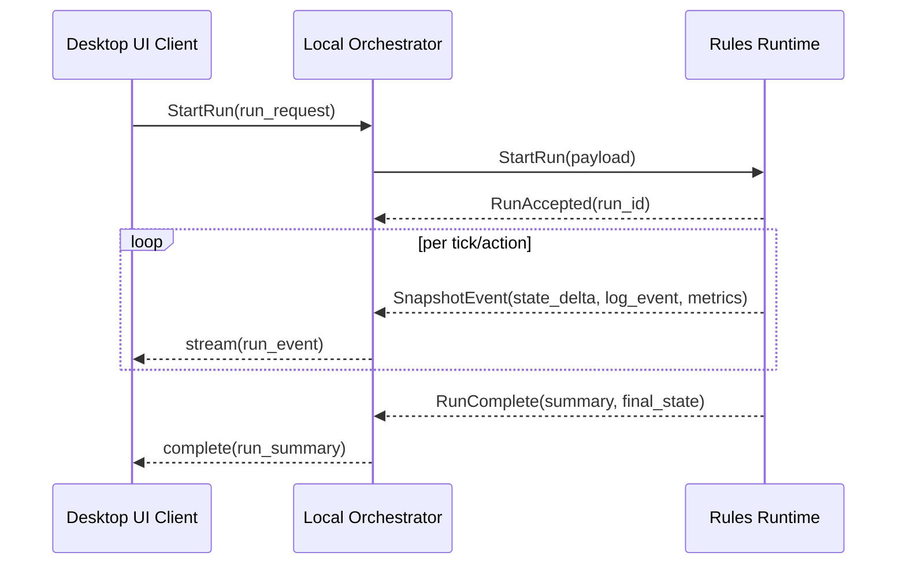

# AvaSim Next-Gen Build Plan

## 1. Document Purpose

This document defines the target architecture and delivery path for a new, optimized AvaSim that:

- is easy to use for single duels, small skirmishes, and large simulation batches,
- supports the Avalore ruleset with deterministic, testable behavior,
- ships with a production-grade fantasy RPG UI,
- can become the backend simulation engine for a future game using the same rules.

It is written for both human engineers and agentic AI systems that need clear, bounded, executable steps.

Companion visual reference: `docs/avasim_visual_schema.md`.

## 2. Product Vision (Target State)

### Primary outcomes

1. **Simulator UX**: Users can build characters, assemble scenarios, run outcomes, and inspect why results happened.
2. **Scale modes**: The same system handles:
   - individual interaction inspection,
   - party skirmish balancing,
   - large batch sweeps for build optimization,
   - player-controlled endless encounters against random ruleset-valid builds.
3. **Backend reuse**: The simulation runtime is exposed as a stable service contract for future game clients.
4. **Production readiness**: Containerized local services, reproducible builds, observability, and distributable desktop apps.

### Why not all Python

Python remains useful for orchestration, experimentation, and analytics, but the final product benefits from a split:

- **Rust** for deterministic, high-performance combat/rules runtime.
- **TypeScript** for desktop orchestration, local service integration, and modern frontend tooling.
- **Python** for simulation workflow automation, balance-analysis scripts, and rapid AI policy iteration.

## 3. Current State Snapshot (from repository)

- Monolithic desktop entrypoint (`pyside_app.py`) with rules and UI tightly coupled at runtime.
- Rules and combat logic in `combat/` are feature-rich and test-backed.
- UI is PySide-based and currently optimized for desktop simulation tooling.
- Existing tests cover core combat/map behavior, but service boundaries are not yet formalized.

## 4. Target Architecture (Offline, Containerized + Reusable)

## 4.1 Service map



## 4.2 Container topology (docker compose baseline)

- `ui-desktop`: React/Vite app in a Tauri desktop shell.
- `orchestrator`: TypeScript local coordinator (run lifecycle, local event routing, storage wiring).
- `rules-engine`: Rust simulation service with strict versioned contracts.
- `sim-worker`: Python worker for batch jobs, parameter sweeps, and reporting.
- `postgres` or `sqlite`: persistent local data.
- `redis`: local queue and ephemeral run-state cache.
- `minio` (or equivalent): run artifacts, replay exports, reports.

All services are local-first and operate without internet dependency.

## 4.3 Responsibility split

- **Rust rules-engine**
  - turn resolution, action economy, RNG control, deterministic snapshots.
  - zero UI assumptions.
- **TypeScript orchestrator**
  - UI-facing contracts, scenario/build lifecycle, local event streaming, storage integration.
- **Python worker**
  - high-volume experiments, balance metrics, scripted search across build spaces.
- **Frontend**
  - scenario authoring, live combat playback, build explorer, explainability surfaces.

## 5. Rules Runtime Contract (future game backend)

The same contract powers AvaSim and future game clients:



Required properties:

- deterministic by `seed` and engine version,
- replayable snapshots,
- structured event log (not raw text only),
- explicit versioned schema for compatibility across clients.
- no internet dependency for core simulation workflows.

## 6. Fantasy-RPG UI Vision (Production + Distribution Level)

### 6.1 Experience direction

- Tone: **tactical grim-fantasy codex** (ornamental but readable).
- Interface style: layered parchment/obsidian panels, runic accents, high-contrast stat glyphs.
- Visual hierarchy: battlefield first, decisions and logs second, deep controls progressively disclosed.

### 6.2 UI pillars

1. **Battlefield as hero surface**
   - map dominates layout,
   - timeline + combat feed docked and collapsible.
2. **Character and build clarity**
   - compact stat blocks, equipment sigils, trait chips, build compare mode.
3. **Explainability first**
   - every outcome has inspectable math, rule references, and event ancestry.
4. **Scale controls**
   - one-click "scenario analysis", "batch optimization", and "endless arena" modes.

### 6.3 Core User Modes

1. **Scenario Analysis Mode**
   - user builds/selects a scenario, then runs and inspects deterministic outcomes.
2. **Batch Optimization Mode**
   - user executes many runs for balance and build-performance analysis.
3. **Endless Arena Mode (new)**
   - user directly controls one character,
   - opponent builds are generated endlessly from the Avalore ruleset,
   - difficulty and build-randomization rules scale over time,
   - run can be paused, resumed, and exported as a replay artifact.

### 6.4 Production UI standards

- Accessibility baseline: keyboard navigation, AA contrast, reduced-motion mode.
- Performance budget: 60fps target in replay view on mainstream hardware.
- Component standards: tokenized colors/typography/spacing with documented design system.
- Distribution: desktop package (Tauri) with offline-first runtime.

## 7. Repo Structure Target (incremental end-state)

```text
avasim/
  apps/
    ui-desktop/             # React + TS desktop UI shell
    orchestrator/           # TypeScript local coordinator
    sim-worker/             # Python batch worker
  services/
    rules-engine/           # Rust core simulator
  packages/
    schema/                 # shared JSON schema / event contracts
    test-fixtures/          # cross-service deterministic fixtures
  infra/
    docker/
      compose.yml
  docs/
    avasim_next_gen_plan.md
```

## 8. Delivery Plan (Small, Daily Steps)

Step sizing rule: each step is scoped to fit one short engineering day.

## Phase 0: Alignment + Baseline Lock (3 days)

1. Write canonical goals/non-goals and success metrics in `docs/`.
   - Done when metrics cover: correctness, performance, UX, deployability.
2. Capture deterministic fixture scenarios from current Python engine.
   - Done when 10 baseline scenarios have fixed seeds + expected outcomes.
3. Freeze current behavior with regression tests around those fixtures.
   - Done when fixtures run in CI and fail on behavior drift.

## Phase 1: Containerized Foundation (4 days)

1. Add `infra/docker/compose.yml` with placeholder services (`orchestrator`, `rules`, `worker`, `postgres`, `redis`).
   - Done when `docker compose up` starts all health checks.
2. Create orchestrator skeleton with `health` and `version` endpoints (local).
   - Done when container returns version metadata.
3. Create worker skeleton that consumes a queue message and logs a stub result.
   - Done when one queued stub job is processed end-to-end.
4. Add local dev scripts (`make` or npm/pnpm scripts) for one-command startup.
   - Done when fresh clone can start stack with one command.

## Phase 2: Contract First (5 days)

1. Define versioned run schema (`RunRequest`, `RunEvent`, `RunSummary`) in `packages/schema`.
   - Done when schema validates sample payloads.
2. Implement run-submission handler (`StartRun`) with schema validation only.
   - Done when invalid payloads are rejected with structured errors.
3. Add local event stream channel for run events (mock source).
   - Done when client receives mocked timeline events.
4. Convert current Python log output into structured event format adapter.
   - Done when existing simulation can emit contract-compliant events.
5. Publish contract docs (JSON schema + event examples).
   - Done when both human and agent can run from docs without reverse engineering.

## Phase 3: Rust Rules Engine Bootstrap (6 days)

1. Initialize Rust service with `/health`, `/simulate` stub.
   - Done when container reachable in compose network.
2. Port core dice/action primitives (seeded RNG + action economy).
   - Done when primitive unit tests pass.
3. Port minimal duel loop (movement + attack + damage resolution).
   - Done when 3 fixture scenarios match Python baseline results.
4. Implement snapshot event emission from Rust service.
   - Done when replay stream is generated with stable schema.
5. Add engine-version stamping to every run output.
   - Done when run summary includes engine semantic version.
6. Add cross-language parity test harness (Python fixtures vs Rust).
   - Done when nightly parity report is generated.

## Phase 4: Orchestrator + Worker Real Runs (5 days)

1. Wire orchestrator run-start flow to call Rust engine.
   - Done when single-run request returns real summary.
2. Wire event stream pass-through to desktop clients.
   - Done when live replay updates appear in UI test client.
3. Implement worker batch job (`N runs with seed range`).
   - Done when batch summary returns aggregate stats.
4. Persist scenarios/builds/run metadata in Postgres.
   - Done when a run can be reopened by ID with full metadata.
5. Store replay/report artifacts in object storage.
   - Done when exported run artifacts are downloadable.

## Phase 5: New UI Foundation (Fantasy RPG Production Pass) (7 days)

1. Set up design tokens (color, type, spacing, motion) for the chosen fantasy direction.
   - Done when all primary UI elements use tokens only.
2. Build app shell layout: command sidebar + battlefield focus + collapsible feed.
   - Done when layout works at laptop and desktop breakpoints.
3. Implement scenario builder v1 (tiles, units, save/load).
   - Done when user can author and replay a custom skirmish.
4. Build combat feed cards from structured events.
   - Done when event icons/types are readable without raw text logs.
5. Build timeline scrubber and event detail panel.
   - Done when user can inspect any step with cause/effect context.
6. Build character/build inspector with compare mode.
   - Done when two builds can be contrasted in one screen.
7. Add accessibility pass (keyboard paths, reduced motion, contrast audit).
   - Done when audit checklist is green.

## Phase 6: Scale + Optimization Features (6 days)

1. Add mode switcher: scenario analysis, batch optimization, endless arena.
   - Done when each mode maps to a clear backend workflow.
2. Add queue progress UI with cancel/retry.
   - Done when user can interrupt long experiments safely.
3. Implement cached repeat-run detection by scenario hash + seed range.
   - Done when duplicate requests reuse prior outputs where valid.
4. Add basic build recommendation heuristics in worker.
   - Done when summary highlights top-performing build sets.
5. Implement endless-arena opponent generator (ruleset-valid random build pipeline).
   - Done when user can complete at least 20 escalating encounters in one run.
6. Add export bundle (CSV + JSON + replay package).
   - Done when one click exports all run artifacts.
7. Add profiling panel (runtime, queue time, event volume).
   - Done when performance bottlenecks are visible in-app.

## Phase 7: Distribution + Operational Hardening (5 days)

1. CI pipelines for lint/test/build across Rust/TS/Python.
   - Done when all services build/test on every PR.
2. Add service observability (structured logs + traces + metrics).
   - Done when a failed run can be traced across services.
3. Desktop packaging via Tauri and offline runtime profile.
   - Done when signed desktop artifact is generated in CI.
4. Add migration/rollback playbook for schema and engine versions.
   - Done when downgrade path is documented and tested.
5. Ship release candidate with acceptance checklist.
   - Done when QA signs off on correctness, UX, and performance thresholds.

## 9. Agent/Human Execution Rules

Every implementation task should include:

- **Input contract**: required files, run payloads, seeds, and assumptions.
- **Output contract**: code paths touched, tests added, artifacts produced.
- **Definition of done**: one objective pass/fail criterion.
- **Rollback note**: how to revert safely if regression appears.

Do not start a new step until the current step's done condition is verifiably met.

## 10. Acceptance Criteria for the "New AvaSim"

1. Same scenario + same seed + same engine version always yields same result.
2. Single-run UX is understandable to a first-time user in under 10 minutes.
3. Batch/sweep workflows complete without UI lockups and show progress.
4. Structured replay data is consumable by both simulator UI and external game clients.
5. Desktop builds are reproducible from containerized pipelines.
